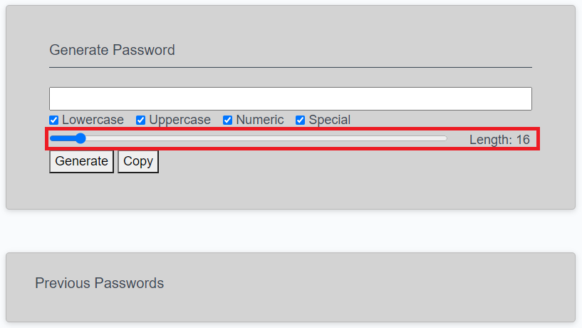

# 03 JavaScript: Password Generator

Create an application that generates a random password based on user-selected criteria. This app will run in the browser and feature dynamically updated HTML and CSS powered by your JavaScript code. It will also feature a clean and polished user interface and be responsive, ensuring that it adapts to multiple screen sizes.

## User Story

```
AS AN employee with access to sensitive data
I WANT to randomly generate a password that meets certain criteria
SO THAT I can create a strong password that provides greater security
```

## Acceptance Criteria

```
GIVEN I need a new, secure password
WHEN I click the button to generate a password
THEN I am presented with a series of prompts for password criteria
WHEN prompted for password criteria
THEN I select which criteria to include in the password
WHEN prompted for the length of the password
THEN I choose a length of at least 8 characters and no more than 128 characters
WHEN prompted for character types to include in the password
THEN I choose lowercase, uppercase, numeric, and/or special characters
WHEN I answer each prompt
THEN my input should be validated and at least one character type should be selected
WHEN all prompts are answered
THEN a password is generated that matches the selected criteria
WHEN the password is generated
THEN the password is either displayed in an alert or written to the page
```

## Application Functionality

1) Open web application should look as shown below:


2) Select password character criteria. Must have at least one checked for the application to run.

Note: All characters types are selected by default. 

3) Drag the slider to select desired password lenght.

Note: 16 is the default slider value. 

4) Click the "Generate" button to run the random password generator.


5) The output should look similar to the following: 

Note: The "Previous Passwords" section will log all passwords generated during your session. Clears upon page reload. 

6) Click the "Copy" button to add the password to your clipboard with ease.

Note: The copy function will not allow you to copy if you have not yet generated a password.

## Version History

Password_generator_v1.0 - Initial commit; Used provided homework layout for index.html, script.js & style.css.

Password_generator_v1.1 - Removed header and added nav bar element to replace it, for styling the top of the page (index.html lines 12-14); Added bootstrap link above css link (index.html line 11).

Password_generator_v1.2 - Removed existing content and replaced with content I have been developing on the side (index.html lines 27-48). Changes include, different text window where password will be displayed (line 32); Added checkbox elements for password criteria selection (lines 35-38); Added slider element for user control of password length/ complexity; also created "onclick" function call for slider (line 41); Added buttons for password generation and for copying the password to clipboard; also created "onclick" function calls for each button (lines 44, 46).

Password_generator_v1.3 - Added sticky footer with version info to bottom of page (index.html lines 57-61); Removed unused CSS lines and added footer related styling (styles.css lines 1-3, 34, 39-52); Changed card background-color to lightgray and the top padding for wrapper div element to 20px (styles.css line 16, 23).

Password_generator_v1.4 - Changed password display and slider styles to extend to 100% of the page (style.css lines 38, 42).  

Password_generator_v1.5 - Removed existing script, and initialized variable "complexity" which keeps track of the slider's value (to be used) to set password length; the value of "complexity" is displyed in the empty div element after the slider (index.html line 48) as "Length: " + complexity (script.js lines 2-10); 

Password_generator_v1.6 - Created function genPass() which is called on the "generate" button click. In its curent form, it uses a sigle char array "genPassVals" along with a math.random loop to create a random password of length "complexity"; The password is stored in the variable "password" during the loop and is pushed into the text display immediatle after loop execution (script.js lines 15-27). 

Password_generator_v1.7 - Added functionality to the checkboxes, so that when selected they pass different character arrays to "genPassVals". Selecting more than one checkbox concatinates the sring of characters selected; however, if no selections are made, an alert is provided to the user and we exit the entire genPass function call (script.js lines 18-50).

Password_generator_v1.8 - Added second card for previously generated passwords to be displayed (index.html lines 54-65); Added functionality to add previously generated passwords within genPass function (script.js line 64).

Password_generator_v1.9 - Added function genPassCopy() to allow the user to copy the most curent password to clip board; User is made aware that password has been copied via alert (script.js lines 69-76). 

Password_generator_v2.0 - Added if statement to prevent the user from copying a blank text feild when no password has been generated (script.js lines 72, 80-84).

Password_generator_v2.1 - Created a better card layout that will resize in a more view friendly manner for smaller devices (index.html 23-34); changed heading sizes to "h5", as I find this size more in-tune with aesthetic hierarchy (index.html line 34, 104). Added line divider between heading and checkbox content (index.html lines 37-38)(style.css line 35-37); Added separate label elements and converted checkboxes to bootstrap "forms", each within div containers to improve how they behave in different viewports (index. html lines 43-69); Moved slider "Lenght" readout into a individual row shared with the slider input element. They share the space 10-2, with the readout assigned the 2 col portion; this ensures that the readout stays in-line with the slider until viewport shrinks below "md" (index.html lines 71-81)(style.css lines 47-50); Added buttons to their own row for future stying (index.html 83-89).

Password_generator_v2.2 - Changed display & lastPasswords font to Courier (typeface) for monospace appearance (for that unmistakable passcode appearance) (style.css lines 41, 53-55).  

Password_generator_v2.3 - Changed file structure, so that the site deploys properly, using the github link I submitted. Changed relative address for the css and javascript files to reflect changes above (index.html lines 12,122).   

Password_generator_v2.4 - Changed the slider event listener for funcion call "slideVal" from onclick to onchange (index.html line 74). This allows for the slider to update while on mobile devices, and while using the keyboard arrows if no click is registered via mouse.

## Wish List

1 - Remove alerts and add text feilds that appear when alert would have triggered; hidden otherwise.

2 - Add read/wirte function so user can save passwords to local drive and manage them.

3 - Add settings for user to set unique defaults.

- - -
© 2019 Trilogy Education Services, a 2U, Inc. brand. All Rights Reserved.